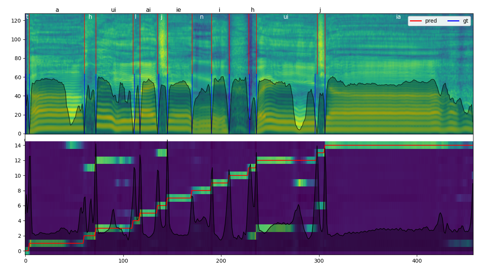

# HubertFA: 基于Hubert的强制对齐工具



## 简介

专为歌声设计的轻量化强制对齐工具，兼容非歌声对齐。基于[SOFA](https://github.com/qiuqiao/SOFA)优化，支持多种音频编码器。

⚠️ **预发布版**：当前分发模型仅推荐使用`mel`编码的ONNX版本，Hubert相关模型可能存在兼容性问题。

[模型分享说明](https://github.com/wolfgitpr/HubertFA/discussions/2)

## 可选输入编码

下表仅为同数据集下经验评分，不做严格参考。

|        encoder        |       mel       | [hubert-soft](https://github.com/bshall/hubert/releases/download/v0.2/hubert-soft-35d9f29f.pt) | [cnhubert](https://huggingface.co/TencentGameMate/chinese-hubert-base) |
|:---------------------:|:---------------:|:----------------------------------------------------------------------------------------------:|:----------------------------------------------------------------------:|
|       encoder体积       |        0        |                                              360m                                              |                                  360m                                  |
| 预处理体积 44.1k 16bit为基准  |      ~1.5x      |                                             ~2.3x                                              |                                  ~3x                                   |
|         模型体积          |     默认参数13m     |                                               同前                                               |                                   同前                                   |
| 最小编辑距离(标注风格影响，不等价于效果) |      0.012      |                                              0.09                                              |                                 0.075                                  |
|         标注风格          | 尽量长（包括发音末尾超短混响） |                                       尽量短（仅覆盖能识别最短发音部分）                                        |                                   同前                                   |
|        channel        |  128(同n_mels)   |                                              256                                               |                                  768                                   |
|      model_path       |        无        |                                          /xxx/xxx.pt                                           |                              xxx/cnhubert                              |

## 快速开始

### 环境配置

1. 克隆仓库并安装依赖：
   ```bash
   git clone https://github.com/your-repo/HubertFA.git
   conda create -n HFA python=3.10 -y
   conda activate HFA
2. 去[pytorch官网](https://pytorch.org/get-started/locally/)安装torch
3. 安装其他python库
    ```bash
    pip install -r requirements.txt
    ```

### 推理

1. 下载模型文件。你可以在本仓库[discussion](https://github.com/wolfgitpr/HubertFA/discussions)中找到onnx模型。
2. --language指定语种(zh ja en yue)，--dictionary指定词典。默认字典为`opencpop-extension.txt`
3. 准备需要强制对齐的数据，放入一个文件夹中（默认放在`/segments`文件夹），格式如下

   ```
      segments/
      ├── singer1/
      │   ├── audio1.wav
      │   ├── audio1.lab  # 录音文本（拼音/音素，空格隔开）
      └── singer2/
          ├── audio2.wav
          └── audio2.lab
   ```

   保证`.wav`文件和对应的`.lab`在同一个文件夹即可。

   录音文本经过`g2p`模块转化为音素序列后，输入模型进行对齐。

   例如，默认情况下使用`DictionaryG2P`模块和`opencpop-extension`词典时，加入录音文本的内容是：
   `gan shou ting zai wo fa duan de zhi jian`，`g2p`模块根据词典转化为音素序列
   `g an sh ou t ing z ai w o f a d uan d e zh ir j ian`。其他`g2p`
   模块的使用方法，参见[g2p模块使用说明](networks/g2p/readme_g2p_zh.md)。

4. 命令行推理

   使用`python infer.py`进行推理。

   需要指定的参数：
    - `--ckpt`：（必须指定）模型权重路径；
    - `--folder`：存放待对齐数据的文件夹（默认为`segments`）；
    - `--in_format`： 录音文本的文件后缀名（默认为`lab`）；
    - `--save_confidence`：输出置信度。
    - `--language`：指定语种，zh ja en yue（默认为`zh`）。
    - `--dictionary`：字典文件（默认为`dictionary/opencpop-extension.txt`）；

    ```bash
    python infer.py -c checkpoint_path -s segments_path -d dictionary_path ...
    ```
5. 获取最终标注

   最终的标注保存在文件夹中，文件夹的名称是你选择的标注格式，这个文件夹的位置和推理所用的wav文件处于同一个文件夹中。

## 高级功能

- 使用自定义的g2p，而不是使用词典
    - 参见[g2p模块使用说明](networks/g2p/readme_g2p_zh.md)

### 训练

1. 参照上文进行环境配置。

   把训练数据按以下格式放入`data`文件夹(也可按个人习惯)：

   ```
   data/
   ├── full_label/  # 完整标注
   │   └── singer/
   │       ├── wavs/*.wav
   │       └── transcriptions.csv  # 需含`ph_seq`和`ph_dur`列
   ├── weak_label/  # 弱标注（无时长） 
   │   └── singer/
   │       ├── wavs/*.wav
   │       └── transcriptions.csv  # 需含`ph_seq`列
   └── no_label/    # 无标注，仅wav
   ```
   
   关于`transcriptions.csv`的格式，参见：https://github.com/qiuqiao/SOFA/discussions/5

   其中：

   `transcriptions.csv`只需要和`wavs`文件夹的相对位置正确即可；

   `weak_label`中的`transcriptions.csv`无需拥有`ph_dur`这一个`column`；

2. 修改配置（参考文件内注释）。

   使用 `make_data_config.py` 自动扫描数据文件夹生成配置文件：

   ```bash
   python make_data_config.py \
     --data_folder data/full_label \  # 数据集根目录
     --language zh \                 # 指定语言标识（zh/ja/en等）
     --output configs/datasets_zh.yaml  # 指定输出文件名（可选）
   ```

   [数据集配置](configs/datasets_config.yaml)

   [预处理配置](configs/binarize_config.yaml)，[datasets_config](configs/datasets_config.yaml)

   [训练配置](configs/train_config.yaml)

3. 按需修改`binarize_config.yaml`，然后执行`python binarize.py --config/-c configs/binarize_config.yaml`；
4. 训练`python train.py --config/-c configs/train_config.yaml`
5. 训练可视化：`tensorboard --logdir=ckpt/`。

## 评估（适用于模型开发者）

可通过在预测（强制对齐）标注与目标（人工）标注之间计算特定的客观评价指标（尤其是在k折交叉验证中）来评估模型性能。

以下指标受标注风格影响，并不是越低越好（相同数据集、encoder时，较低值可以考虑使用）。

- BoundaryEditRatio: 边界编辑比率，从预测的边界到目标边界的总移动距离。
- BoundaryEditRatioWeighted: 边界编辑加权距离，包括音素未对齐数量*0.1。
- VlabelerEditRatio10-20ms: 边界错误率，在给定的容差值下，位置错误的边界数占据目标边界总数的比例。

若要在特定的数据集上验证你的模型，请先运行推理以得到所有的预测标注。随后，你需要将预测标注与目标标注放置在不同的文件夹中，相对应的标注文件需要保持相同文件名、相同相对路径，并包含相同的音素序列（空白音素除外）。此脚本当前仅支持TextGrid格式。

运行以下命令：

```bash
python evaluate.py <PRED_DIR> <TARGET_DIR> -r
```

其中 `PRED_DIR` 是包含所有预测标注的目录，`TARGET_DIR` 是包含所有目标标注的目录。

可选项：

- `-r`, `--recursive`: 递归对比子文件夹中的文件
- `--ignore`: 忽略部分音素记号（默认值：`AP,SP,<AP>,<SP>,,pau,cl`）

# 参考项目

+ [SOFA](https://github.com/qiuqiao/SOFA)
+ [DDSP-SVC](https://github.com/yxlllc/DDSP-SVC)
+ [hubert](https://github.com/bshall/hubert)