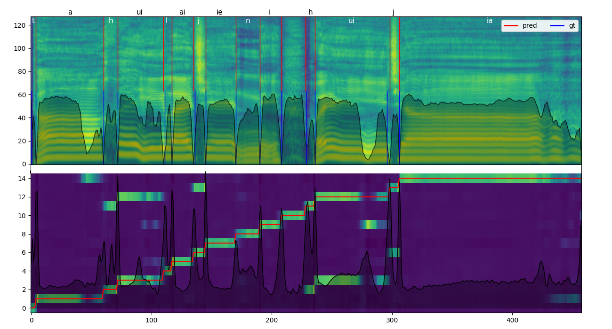

# HubertFA: A forced alignment tool based on Hubert



## Introduction

A lightweight forced alignment tool specifically designed for singing voice, compatible with non-singing voice
alignment.

Based on [SOFA](https://github.com/qiuqiao/SOFA)
and [FoxBreatheLabeler](https://github.com/autumn-DL/FoxBreatheLabeler).

Optimization, support for aligned phonemes and automatic recognition of non-articulate phonemes (such as breathing).

[Model sharing instructions](https://github.com/wolfgitpr/HubertFA/discussions/2).

## Quick Start

### Environment Configuration

1. Clone git and create conda environment:
   ```bash
   git clone https://github.com/wolfgitpr/HubertFA
   conda create -n HFA python=3.10 -y
   conda activate HFA
   ```

2. Install python dependence:

   Only for onnx infer:

    ```bash
    pip install -r requirements_onnx.txt
    ```

   Train:

   Please go to [PyTorch official website](https://pytorch.org/get-started/locally/) to install torch with a version
   lower than 2.9.

    ```bash
    pip install -r requirements.txt
    ```

### Infer

1. Download the model file. You can find the ONNX model in this
   repository's [release](https://github.com/wolfgitpr/HubertFA/releases)
   or [discussion](https://github.com/wolfgitpr/HubertFA/discussions).
2. Prepare the data that needs to be forcibly aligned and place it in a folder (default to the '/segments' folder), in
   the following format.

   ```
      segments/
      ├── singer1/
      │   ├── audio1.wav
      │   ├── audio1.lab  # Recorded text (pinyin/phoneme, separated by spaces), such as "gan shou ting".
      └── singer2/
          ├── audio2.wav
          └── audio2.lab
   ```

   Ensure that the wav file and it's corresponding. lab file are in the same folder.

3. Command line reasoning

   onnx infer (recommend)

    ```bash
    python onnx_infer.py --onnx_path xxx --wav_folder xxx_wav --language zh ...
    ```

   args:
    - `--onnx_path` / `-m`: Path to Onnx models.
    - `--wav_folder` / `-wf`: Input folder path. (default: `segments`)
    - `--out_path` / `-o`: Path to the output label.
    - `--language` / `-l`: Designated language, zh ja en yue. (default: `zh`)
    - `--non_speech_phonemes` / `-np`: Non speech phonemes. (default: `AP`, optional `AP,EP`)
    - `--pad_times` / `-pt`: The number of times to pad blank audio before reasoning. (default: `1`)
    - `--pad_length` / `-pl`: The max length of blank audio on the pad before inference. (default: `5`)
    - `--dictionary` / `-d`: Custom dictionary path.

   ckpt infer (developer)

    ```bash
    python infer.py --nll_path xxx --fa_path xxx --wav_folder xxx_wav --language zh ...
    ```

   args:
    - `--nll_path` / `-nll`: Path to nll models.
    - `--fa_path` / `-fa`: Path to fa models.
    - `--encoder` / `-e`: Path to the encoder (hubert) model. (optional)
    - `--wav_folder` / `-wf`: Input folder path. (default: `segments`)
    - `--g2p` / `-g`: G2P class name. (default: `dictionary`)
    - `--non_lexical_phonemes` / `-np`: Non speech phonemes. (default: `AP`, optional `AP,EP`)
    - `--language` / `-l`: Dictionary language. (default: `zh`)
    - `--dictionary` / `-d`: Custom dictionary path.
    - `--pad_times` / `-pt`: The number of times to pad blank audio before reasoning. (default: `1`)
    - `--pad_length` / `-pl`: The max length of blank audio on the pad before inference. (default: `5`)

4. Obtain the final annotation

   The final annotation is saved in a folder named after the annotation format you have chosen, which is located in the
   same folder as the WAV file used for inference.

### Train

The training of HubertFA is divided into two independent stages:

NLL (Non_Lexical Label) model: recognizes non_lexical phonemes (such as breathing sounds) without the need for phoneme
labeling during inference.

FA (forced alignment) model: Aligns phonemes with audio, requiring phoneme annotation during inference.

1. Refer to the previous text for environment configuration.

   Put the training data into the 'data' folder in the following format (or according to personal habits):

   ```
   data/
   └── full_label/
       └── singer/
           ├── wavs/*.wav
           └── transcriptions.csv  # Contains columns 'name', 'ph_deq' and 'ph_rur'.
   ```

   ```
   name,ph_seq,ph_dur
   myaudio_1,b ie r ong h ua l e y En l ei AP SP,0.07859 0.40293 0.09818 0.41515 0.11034 0.3453 0.15223 0.35642 0.0937 0.24446 0.09266 0.34733 0.24899 0.2778780726
   myaudio_2,SP sh uo g an AP SP j iu g an AP z ai d ao x ia zh ir q ian zh ir q iu h uo g e t ong k uai AP SP,0.3567800454 0.18395 0.54211 0.09266 0.63328 0.24868 0.05809 0.11525 0.56118 0.08851 0.64217 0.22428 0.11764 0.18132 0.06359 0.16275 0.07434 0.13661 0.07883 0.19637 0.10148 0.26796 0.04816 0.15877 0.07283 0.18856 0.11828 0.21115 0.09586 0.13446 0.11893 0.35909 0.06789 0.41733 0.16352 0.2607256236
   ```

    + name is the filename of the WAV file without the extension.

    + ph_seq is the phoneme annotation sequence for the WAV file, separated by spaces. Any phonemes listed in
      ignored_phonemes within the configs/binarize_config.yaml will be considered as SP.

    + ph_dur corresponds to the duration sequence for each phoneme in the sequence, measured in seconds, and also
      separated by spaces.

2. modify configuration

   Automatically scan the data folder to generate a configuration file using 'make_dataconfig.py':

   ```bash
   python make_data_config.py \
     --data_folder data/full_label \    # Root directory of dataset
     --language zh \                    # Specify language identifier (zh/ja/en, etc.)
     --output configs/datasets_zh.yaml  # Specify output file name (optional)
   ```

   [datasets config](configs/datasets_config.yaml)

   ```bash
   - raw_data_dir: data/full_label/male1_byBaiShuo/raw
     label_type: full       # full/evaluate， The two formats are the same, and the evaluate dataset is used as an unseen spk to evaluate the performance of the model.
     language: zh
     test_prefixes:
       - B3_o_n_o_o_a_o_i_o
   ```

3. Modify config.yaml as needed, then execute
   ```bash
   python binarize.py -- config/- c configs/*. yaml -- model nll/fa 
   ```

   [nll config](configs/non_lexical_labeler.yaml)

   [fa config](configs/force_alignment.yaml)

4. Training: `python train.py --config/-c configs/*.yaml  --model nll/fa`
5. Training visualization: `tensorboard --logdir=ckpt/`。

+ Nll model reference indicators `unseen_evaluate/frame_error_rate`

+ FA model reference indicators `unseen_evaluate/total`

+ During training, the lower n models will be automatically saved, and the best model will be selected from the 2-3
  models with the lowest metrics. The evaluation dataset should use spk that did not participate in training, and the
  annotation accuracy should be higher.

## Evaluation (applicable to model developers)

Model performance can be evaluated by calculating specific objective evaluation metrics (especially in k-fold cross
validation) between predicted (forced alignment) annotations and target (manual) annotations.

The following indicators are influenced by the annotation style, and lower values are not necessarily better (when using
the same dataset and encoder, lower values can be considered for use).

- BoundaryEditRatio: The total distance traveled from the predicted boundary to the target boundary.
- BoundaryEditRatioWeighted: Weighted distance for boundary editing, including the number of phonemes not aligned * 0.1.
- VlabelerEditRatio10-20ms: Boundary error rate, the proportion of boundaries with incorrect positions to the total
  number of target boundaries within a given tolerance value.

To validate your model on a specific dataset, first run inference to obtain all predicted annotations. Subsequently, you
need to place the predicted annotation and the target annotation in different folders, and the corresponding annotation
files need to maintain the same file name, relative path, and contain the same phoneme sequence (except for blank
phonemes). This script currently only supports TextGrid format.

Run the following command:

```bash
python scripts/evaluate.py PRED_DIR TARGET_DIR -r
```

Among them, ` PRED_DIR ` is the directory containing all predicted annotations, and ` TARGET-DIR ` is the directory
containing all target annotations.

Optional:

- `-- recursive`, `-r`: recursively compare files in subfolders
  --- ignore: Ignore some phoneme markers (default values: AP, SP,<AP>,<SP>, Pau, cl)

## Dictionary Migration Tool

This tool helps migrate phoneme transcriptions from one dictionary format to another across multiple dataset label
formats.

### Supported Formats

- **TextGrid** (`.TextGrid`) - Forced alignment labels
- **CSV** (`.csv`) - Transcription files with `ph_seq` column
- **YAML** (`.yaml`) - OpenUTAU `dsdict.yaml` dictionaries

1. Migrate TextGrid Files

   ```bash
   python scripts/migrate_dict.py tg [TEXTGRID_DIR] \
       --source-dict [SOURCE_DICT] \
       --target-dict [TARGET_DICT] \
       --save-path [OUTPUT_DIR] \
       [--overwrite]
   ```

    - `TEXTGRID_DIR`: Directory containing .TextGrid files

    - `--source-dict`: Path to source dictionary file.

    - `--target-dict`: Path to target dictionary file.

    - `--save-path`: Directory to save migrated files.

    - `--overwrite`: Overwrite existing files (optional flag).

2. Migrate CSV Transcription Files

   ```bash
   python scripts/migrate_dict.py csv [TRANSCRIPTION_CSV] \
       --source-dict [SOURCE_DICT] \
       --target-dict [TARGET_DICT] \
       [--save-path [OUTPUT_CSV] ] \
       [--overwrite]
   ```

    - `TRANSCRIPTION_CSV`: Path to CSV file with transcriptions.

    - `--source-dict`: Path to source dictionary file.

    - `--target-dict`: Path to target dictionary file.

    - `--save-path`: Path to save migrated file (defaults to original file).

    - `--overwrite`: Overwrite existing file (optional flag).

3. Migrate OpenUTAU dsdict.yaml

   ```bash
   python scripts/migrate_dict.py yaml [DSDICT_YAML] \
       --lang [LANGUAGE_CODE] \
       [--main] \
       --source-dict [SOURCE_DICT] \
       --target-dict [TARGET_DICT] \
       [--save-path [OUTPUT_YAML] ] \
       [--overwrite]
   ```

    - `DSDICT_YAML`: Path to dsdict.yaml file.

    - `--lang`: Language code to filter entries (e.g., "en", "ja").

    - `--main`: Treat language as main language (migrate entries without prefix).

    - `--source-dict`: Path to source dictionary file.

    - `--target-dict`: Path to target dictionary file.

    - `--save-path`: Path to save migrated file (defaults to original file).

    - `--overwrite`: Overwrite existing file (optional flag).

# Reference project

+ [SOFA](https://github.com/qiuqiao/SOFA)
+ [FoxBreatheLabeler](https://github.com/autumn-DL/FoxBreatheLabeler)
+ [DDSP-SVC](https://github.com/yxlllc/DDSP-SVC)
+ [chinese-hubert](https://github.com/TencentGameMate/chinese_speech_pretrain)
